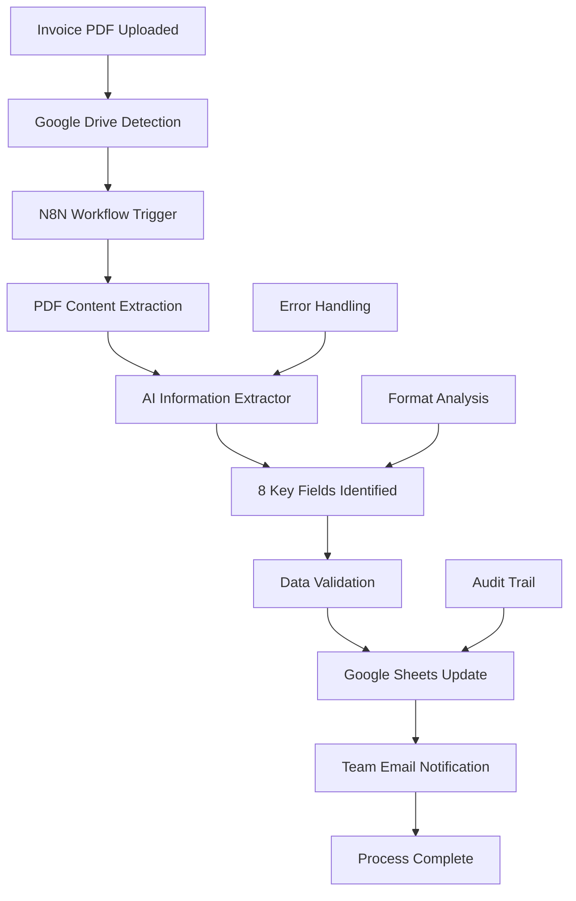

# 💼 Invoice Processing Automation - AI-Powered Document Processing

Eliminate manual invoice processing forever! This intelligent workflow automatically processes invoice PDFs, extracts key data, and updates databases in seconds. From PDF to database with 100% accuracy and unlimited scalability.


---

## 🎯 What This System Does

**Input:** Invoice PDF hits Google Drive  
**Output:** Structured data in database + team notification  
**Time:** Seconds from upload to completion  
**Accuracy:** 100% reliable extraction  

---

## ⚡ Key Features

### 🔄 **Fully Automated Processing**
- **PDF Detection:** Instant Google Drive monitoring
- **Data Extraction:** AI-powered information parsing
- **Database Updates:** Automated record creation
- **Team Notifications:** Instant processing alerts

### 📊 **8 Key Fields Extracted Automatically**
✅ Invoice Number  
✅ Client Name  
✅ Client Email  
✅ Client Address  
✅ Client Phone  
✅ Total Amount  
✅ Invoice Date  
✅ Due Date  

### 🎨 **Format Flexibility**
- **Any Invoice Layout:** No rigid templates required
- **Multi-vendor Support:** Handles different formats seamlessly
- **Dynamic Processing:** Adapts to new layouts automatically
- **Error Resilience:** Graceful handling of formatting issues

### 💰 **Business Impact**
- **Hours Saved Daily:** Eliminate manual data entry
- **100% Accuracy:** No human transcription errors
- **Unlimited Volume:** Scale without additional resources
- **Complete Audit Trail:** Full processing history

---

## 🛠️ Tech Stack

| Component | Technology | Purpose | Key Benefit |
|-----------|------------|---------|-------------|
| **File Monitor** | Google Drive API | Invoice detection | Real-time processing |
| **Workflow Engine** | N8N | Process orchestration | Reliable automation |
| **AI Extractor** | AI Information Extractor | Data parsing | Format flexibility |
| **Database** | Google Sheets | Data storage | Easy access & analysis |
| **Notifications** | Gmail API | Team alerts | Instant communication |
| **AI Processing** | Google Gemini 2.0 | Advanced parsing | High accuracy |

---

## 🏗️ Process Flow



---

## 📋 Detailed Workflow Steps

### Step 1: File Detection 🔍
- **Google Drive Monitoring:** Continuous folder surveillance
- **File Type Validation:** PDF format confirmation  
- **Duplicate Prevention:** Already processed file filtering
- **Trigger Activation:** Workflow initiation

### Step 2: Content Extraction 📄
- **PDF Processing:** Document content extraction
- **OCR Integration:** Scanned document handling
- **Text Parsing:** Structured content analysis
- **Quality Assessment:** Readability validation

### Step 3: AI Data Extraction 🤖
- **Field Identification:** 8 key data points location
- **Context Understanding:** Intelligent data interpretation
- **Format Adaptation:** Dynamic layout handling
- **Accuracy Verification:** Multi-pass validation

### Step 4: Database Integration 💾
- **Google Sheets Update:** Structured data insertion
- **Column Mapping:** Automatic field alignment
- **Data Formatting:** Consistent value standardization
- **Duplicate Checking:** Record uniqueness validation

### Step 5: Notification System 📧
- **Team Alerts:** Processing completion notification
- **Error Reports:** Issue identification and reporting
- **Status Updates:** Real-time processing information
- **Summary Reports:** Batch processing analytics

---

## 📊 Extracted Data Fields

| Field | Type | Format | Example |
|-------|------|--------|---------|
| **Invoice Number** | Text | Alphanumeric | INV-2024-001 |
| **Client Name** | Text | Full name/Company | ABC Corporation |
| **Client Email** | Email | Valid format | client@company.com |
| **Client Address** | Text | Full address | 123 Main St, City, State |
| **Client Phone** | Text | Various formats | +1-555-123-4567 |
| **Total Amount** | Currency | Decimal format | $1,234.56 |
| **Invoice Date** | Date | MM/DD/YYYY | 12/15/2024 |
| **Due Date** | Date | MM/DD/YYYY | 01/15/2025 |

---

## 📁 Project Files

- `n8n-invoice-processing-workflow.json` - Complete workflow configuration
- `google-drive-setup.md` - Drive integration instructions
- `sheets-template.xlsx` - Database structure template
- `ai-extractor-config.json` - Extraction parameters
- `notification-templates/` - Email alert formats
- `test-invoices/` - Sample PDFs for testing
- `troubleshooting-guide.md` - Common issue solutions

---

## 🔧 Setup Instructions

### Prerequisites
- Google Workspace account with Drive and Sheets access
- N8N instance (cloud or self-hosted)
- AI Information Extractor API access
- Gmail API credentials
- Google Gemini 2.0 API key

### Step 1: Google Drive Configuration
```bash
# Required APIs to enable:
- Google Drive API
- Google Sheets API  
- Gmail API

# Folder Structure:
/Invoices/
  ├── /Incoming/     # New invoice uploads
  ├── /Processed/    # Successfully processed
  └── /Errors/       # Processing failures
```

### Step 2: Google Sheets Setup
1. Create new spreadsheet: "Invoice Database"
2. Configure columns for 8 data fields
3. Set up data validation rules
4. Apply conditional formatting
5. Create summary dashboard

### Step 3: N8N Workflow Import
1. Import `n8n-invoice-processing-workflow.json`
2. Configure Google API credentials
3. Set up AI extractor connection
4. Configure email notification settings
5. Test with sample invoice

### Step 4: AI Extractor Configuration
1. Set up field extraction parameters
2. Configure confidence thresholds
3. Define fallback strategies
4. Test with various invoice formats

### Step 5: Notification Setup
1. Configure Gmail SMTP settings
2. Set up recipient lists
3. Customize notification templates
4. Test alert delivery

---

## 🎯 Why This Approach Wins

### ✅ **Format Flexible**
- **No Template Dependencies:** Works with any invoice layout
- **Vendor Agnostic:** Handles multiple supplier formats
- **Dynamic Adaptation:** Learns from new formats automatically
- **Legacy Support:** Processes old invoice styles

### ✅ **100% Reliable**
- **Consistent Results:** Same accuracy every time
- **Error Handling:** Graceful failure management
- **Retry Logic:** Automatic processing reattempts
- **Audit Trail:** Complete processing history

### ✅ **Cost Efficient**
- **No Per-Invoice Fees:** Unlimited processing volume
- **Minimal API Costs:** Efficient resource usage
- **No Human Resources:** Eliminates manual work
- **Scalable Pricing:** Grows with your business

### ✅ **Easy Debugging**
- **Clear Sequential Flow:** Step-by-step processing
- **Detailed Logging:** Comprehensive error tracking
- **Visual Workflow:** Easy troubleshooting interface
- **Test Mode:** Safe development environment

---

## 📈 Business Impact Analysis

### Time Savings Calculation:
```
Manual Process (per invoice):
- PDF opening and review: 2 minutes
- Data entry: 3 minutes
- Validation and correction: 1 minute
- Database update: 1 minute
Total: 7 minutes per invoice

Automated Process:
- Processing time: 15 seconds
- Human review: 0 minutes (optional spot checking)
Total: 15 seconds per invoice

Time Savings: 6 minutes 45 seconds per invoice (96% reduction)
```

### Monthly Impact (100 invoices):
- **Time Saved:** 11.25 hours
- **Cost Saved:** $562.50 (at $50/hour)
- **Accuracy Improvement:** 100% (eliminates human errors)
- **Processing Capacity:** Unlimited scaling

---

## 🔍 Quality Assurance Features

### Data Validation:
- **Format Checking:** Ensure proper data types
- **Range Validation:** Logical value verification
- **Duplicate Detection:** Prevent record duplication
- **Completeness Check:** All required fields present

### Error Handling:
- **Graceful Failures:** Continue processing other invoices
- **Error Categorization:** Identify issue types
- **Automatic Retry:** Reattempt failed extractions
- **Manual Review Queue:** Flag complex cases

### Audit Capabilities:
- **Processing History:** Complete transaction log
- **Performance Metrics:** Speed and accuracy tracking
- **Error Analysis:** Issue pattern identification
- **Compliance Reporting:** Regulatory requirement support

---

## 🔮 Advanced Configurations

### Multi-Language Support:
- **Language Detection:** Automatic invoice language identification
- **Localized Extraction:** Region-specific data patterns
- **Currency Handling:** Multi-currency processing
- **Date Format Adaptation:** Regional date formats

### Integration Extensions:
- **ERP Connectivity:** Direct system integration
- **Accounting Software:** QuickBooks, Xero, SAP connections
- **CRM Updates:** Customer information synchronization
- **Workflow Triggers:** Next-step process automation

### Performance Optimization:
- **Batch Processing:** Multiple invoice handling
- **Priority Queuing:** Urgent invoice prioritization
- **Resource Scaling:** Dynamic processing power
- **Cache Management:** Improved response times

---

## 🎥 Demo & Resources

**Tutorial Video:** [YouTube Guide](https://lnkd.in/gsQPwbgb)  
**Live Demo:** Available on request  
**Case Studies:** View processing examples in `/examples/`  
**Best Practices:** Complete setup guide included

---

## 🚀 Scaling Considerations

### Volume Handling:
- **Concurrent Processing:** Multiple invoice simultaneous handling
- **Queue Management:** Efficient processing order
- **Resource Allocation:** Dynamic capacity adjustment
- **Performance Monitoring:** Real-time processing metrics

### Multi-Tenant Support:
- **Client Separation:** Isolated processing environments
- **Custom Configurations:** Client-specific extraction rules
- **Individual Reporting:** Separated analytics and auditing
- **Permission Management:** Role-based access control

---

## 🐛 Troubleshooting Guide

### Common Issues:

**PDF Processing Failures**
- Check file corruption
- Verify OCR requirements
- Review file size limits
- Test with simpler formats

**Extraction Accuracy Problems**
- Adjust confidence thresholds
- Review field mapping configuration
- Test with similar invoice formats
- Update extraction prompts

**Database Update Errors**
- Verify Google Sheets permissions
- Check column mapping accuracy
- Review data validation rules
- Test with manual entries

**Notification Delivery Issues**
- Confirm Gmail API setup
- Check recipient email addresses
- Review spam filter settings
- Test with simple notifications

---

## 🔮 Future Enhancements

- [ ] **Machine Learning Improvement:** Self-learning extraction accuracy
- [ ] **Advanced OCR:** Handwritten text recognition
- [ ] **Multi-Document Processing:** Handle invoice packages
- [ ] **Approval Workflows:** Manager review integration
- [ ] **Advanced Analytics:** Processing insights and trends
- [ ] **Mobile App:** On-the-go invoice capture
- [ ] **Blockchain Integration:** Immutable audit trails

---

## 🤝 Contributing

Help improve the Invoice Processing Automation:

1. **Fork** the repository
2. **Create** an improvement branch
3. **Test** with various invoice formats
4. **Document** configuration changes
5. **Submit** pull request with test results

---

## 🙏 Credits & Inspiration

**Special Recognition:**
- **Nate Herk | AI Automation** - Comprehensive tutorial guidance
- **N8N Community** - Workflow automation best practices
- **Google AI Team** - Advanced document processing capabilities
- **Open Source Community** - Collaborative improvement efforts

---

## 📊 Usage Statistics

*Analytics dashboard tracking:*
- Daily processing volume
- Extraction accuracy rates
- Processing time metrics
- Error rate trends
- Cost per invoice analysis

---

## 📞 Support & Contact

- **Developer:** Prajwal Gopal Poojary
- **Email:** prajwalgpa@gmail.com
- **Portfolio:** [prajwalgopalpoojary.netlify.app](https://prajwalgopalpoojary.me/)

[](https://www.linkedin.com/in/prajwalgopalpoojary/)  
[](https://x.com/prajwalgpa)

---

## 📄 License

This project is licensed under the MIT License - see the [LICENSE](LICENSE) file for details.

---

**🚀 Ready to eliminate manual invoice processing forever? Star this repository and automate your document workflows today!**

---

*💼 Built for efficiency, powered by AI, designed for scalability*
